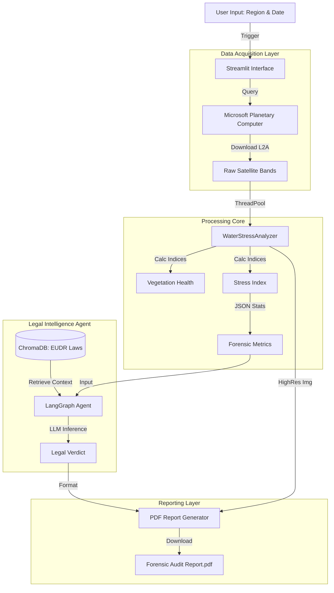

# 🛰️ EcoSentinel: Integrated Agentic RAG & Multi-Spectral Satellite Pipeline for EUDR Compliance

[](https://www.python.org/)
[](https://streamlit.io/)
[](https://planetarycomputer.microsoft.com/)
[](LICENSE)

> **"An AI-driven geospatial framework integrating live satellite telemetry with a Legal RAG Agent to automate 'Due Diligence' for the European Union Deforestation Regulation (EUDR)."**

**EcoSentinel** is a high-performance system designed to verify supply chain compliance with Regulation (EU) 2023/1115. 

By combining the **Microsoft Planetary Computer API** for real-time Sentinel-2 imagery with a **Retrieval-Augmented Generation (RAG) Legal Agent**, the pipeline autonomously performs multi-spectral deforestation risk assessments and drafts forensic legal compliance statements.

---

## 🏗️ System Architecture



---

## 🚀 Key Capabilities

*   **Autonomous Tasking:** Automatically searches, filters (cloud cover < 25%), and downloads Sentinel-2 L2A imagery.
*   **Parallel Processing:** Uses `ThreadPoolExecutor` and `ProcessPoolExecutor` to handle heavy raster computations without UI lag.
*   **Smart Masking:** Implements a Multi-Index Decision Tree:
    *   **NDVI & GNDVI:** Assesses plant health, chlorophyll levels, and forest degradation.
    *   **NDWI:** Masks out water bodies to prevent false positives.
*   **Legal Reasoning Agent:** A LangGraph and ChromaDB-powered RAG agent that ingests the calculated telemetry metrics to autonomously draft compliance statements referencing specific EU Articles (e.g., Articles 3, 9, 24).
*   **Forensic Audits:** Seamlessly combines high-resolution satellite imagery, spectral statistics, and LLM-generated legal verdicts into a comprehensive PDF report.

---

## 🕹️ Three Modes of Operation

EcoSentinel offers three distinct ways to target and audit land areas.

### 1. Preset Agricultural Hubs
Select from known high-risk or high-value regions (e.g., Amazon Rainforest, Bordeaux Vineyards) for instant analysis.


📄 **[Download Detailed Analysis Report (PDF)](docs/presets_values_amazon.pdf)**

### 2. Global Geocoding Search
Type any address, city, or region name. The system geocodes the input and tasks the satellites for a 10km radius around that point.


📄 **[Download detailed Analysis Report (PDF)](docs/Keyword_search_any_region_globally.pdf)**

### 3. Interactive Area Drawing
Use the polygon tool to draw specific farm boundaries. Ideally suited for checking specific land parcels against EUDR plot data.


📄 **[Download detailed Analysis Report (PDF)](docs/Draw_any_region_gloabaly.pdf)**

---

## 🛠️ Modular Pipeline

The system utilizes a decoupled architecture to separate heavy processing from agentic reasoning:

1.  **`ingest.py`**: Connects to the STAC Catalog, filters for the least cloudy scenes, creates a median mosaic, and saves raw bands (`B02`, `B03`, `B04`, `B08`).
2.  **`process.py`**: Reads raw bands to generate True Color Composites, calculates spectral masks (NDVI/NDWI), and extracts forensic JSON metrics.
3.  **`agent.py`** : Orchestrates the LangGraph workflow, querying the ChromaDB vector store for EUDR laws and generating the LLM legal verdict.
4.  **`app.py`**: The Streamlit frontend that wires the pipeline, handles user interactions, and renders the final PDF compliance report.

---

## 📦 Installation & Setup

### Prerequisites
*   Python 3.10+
*   Git

### 1. Clone the Repository
```bash
git clone https://github.com/sameerhussai230/ecosentinel-multispectral-eudr.git
cd ecosentinel-multispectral-eudr
```

